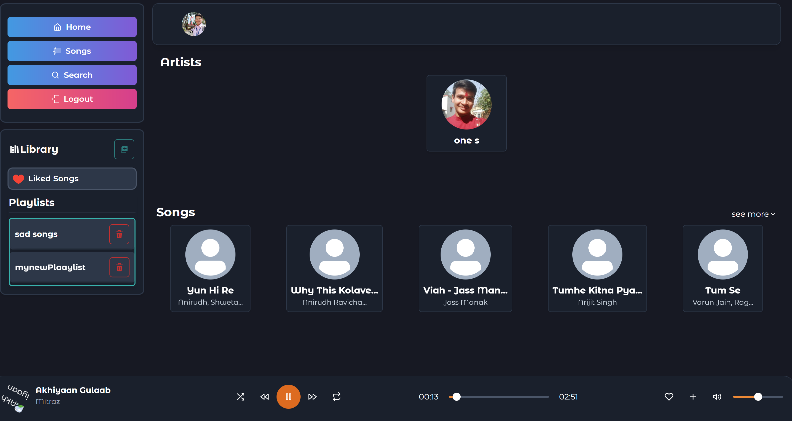
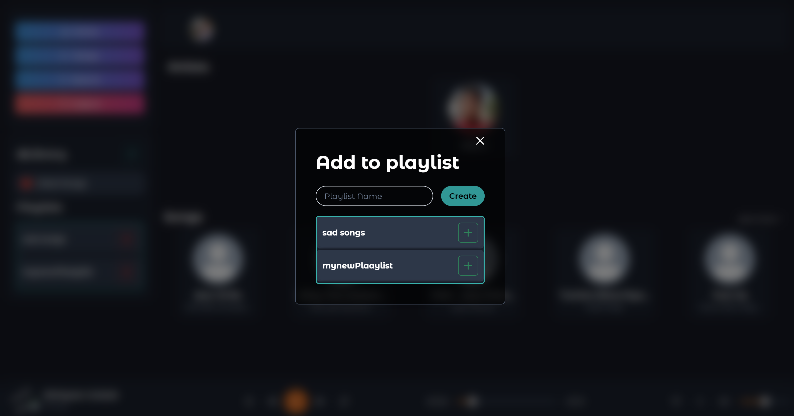

# 🎶 React Music Player – Full Stack Application  [](https://vaiaksh-music.vercel.app/)

A modern, responsive **Music Player Web App** built with **React + Vite (frontend)** and **Node.js + Express + MongoDB (backend)**. This platform allows users to play songs, create playlists, mark favorites, and explore artists with a smooth and elegant interface.

---

## ✨ Features

### 🎧 User Features

* Play, pause, and navigate through songs with a sleek player.
* Create and manage playlists.
* Add/remove favorites for quick access.
* Explore songs and artists with carousel highlights.
* Login system for personalized music experience.

### 🛠 Admin Features

* Manage songs (upload, delete, update metadata).
* Manage playlists and user data.
* Secure authentication for admin actions.

### 🌟 Other Highlights

* Responsive design for mobile & desktop.
* Animated carousels (images & videos).
* Custom loaders and smooth page transitions.
* Backend API with JWT authentication.
* Cloudinary integration for song/image storage.
* Ready-to-deploy configuration with **Vercel**.

---

## 🛠 Tech Stack

* **Frontend:** React, Vite, Tailwind CSS / CSS Modules
* **Backend:** Node.js, Express.js, MongoDB
* **Authentication:** JWT, bcrypt
* **Media Management:** Multer, Cloudinary
* **Deployment:** Vercel (frontend & backend)
* **Utilities:** ESLint

---

## 🚀 Getting Started

### Prerequisites

Ensure you have installed:

* **Node.js** (v16 or above)
* **npm** or **yarn**
* MongoDB (local or cloud e.g., MongoDB Atlas)

---

### ⚡ Running Locally

#### 1. Clone the repository

```bash
git clone [https://github.com/your-username/react-music-player.git](https://github.com/aks1727/React-Music-player.git)
cd react-music-player
```

#### 2. Setup Backend (Server)

```bash
cd Server
npm install

# Create a .env file with the following:
MONGODB_URI=your_mongodb_connection_string
PORT=5000
JWT_SECRET=your_secret_key
CLOUDINARY_URL=your_cloudinary_url
EMAIL_USER=your_email
EMAIL_PASS=your_password

# Run server
npm run dev
```

Backend runs at **[http://localhost:5000](http://localhost:5000)**

#### 3. Setup Frontend (Client)

```bash
cd ../Client
npm install
npm run dev
```

Frontend runs at **[http://localhost:5173](http://localhost:5173)**

---

## 📂 Project Structure

```
react-music-player/
├── Client/                  # Frontend (React + Vite)
│   ├── index.html
│   ├── package.json
│   ├── vite.config.js
│   ├── public/
│   └── src/
│       ├── App.jsx
│       ├── components/      # Player, Artists, Carousel, etc.
│       ├── pages/           # Home, Favorites, MusicPlayer
│       ├── conf/            # Config & utils
│       └── assets/
│
├── Server/                  # Backend (Node.js + Express)
│   ├── src/
│   │   ├── app.js           # Express app config
│   │   ├── index.js         # Entry point
│   │   ├── controllers/     # Song, playlist, user controllers
│   │   ├── models/          # MongoDB models
│   │   ├── routes/          # API routes
│   │   ├── middlewares/     # Auth, error, multer
│   │   └── utils/           # Cloudinary, responses, etc.
│   ├── package.json
│   └── vercel.json          # Deployment config
│
└── readme.md                # Project documentation
```

---

## 🌍 Deployment

Both **Client** and **Server** are ready for deployment on **Vercel**.

* **Frontend (Client):**

  * Framework: `Vite`
  * Build command: `npm run build`
  * Output directory: `dist`

* **Backend (Server):**

  * Framework: `Node.js`
  * Add environment variables in Vercel dashboard.
  * Install command: `npm install`
  * Start command: `npm start`

---

## 📸 Screenshots / Preview


* 
* 
* 

---

## 🤝 Contributing

Contributions are welcome!

1. Fork the repo.
2. Create your branch (`git checkout -b feature/YourFeature`).
3. Commit changes (`git commit -m 'Add feature'`).
4. Push branch (`git push origin feature/YourFeature`).
5. Open a Pull Request.

---

## 📜 License

This project is licensed under the **MIT License**.

---

💡 *Built with ❤️ to make music streaming simple and beautiful.*
